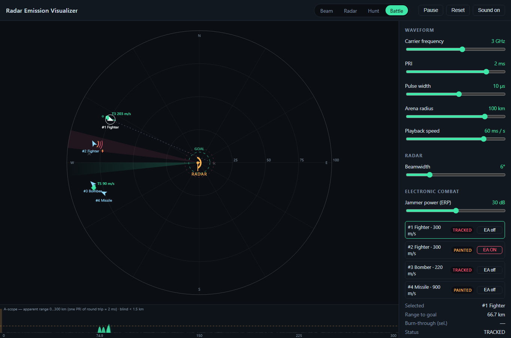
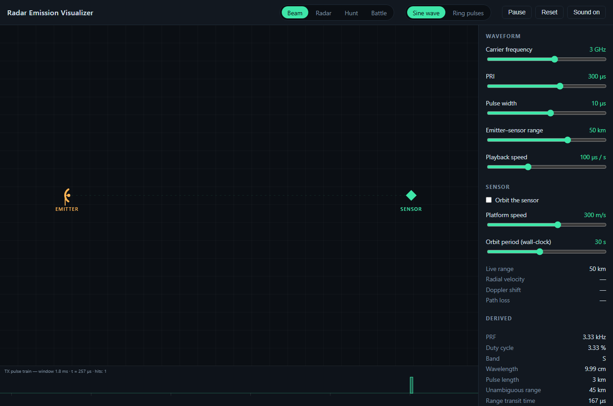
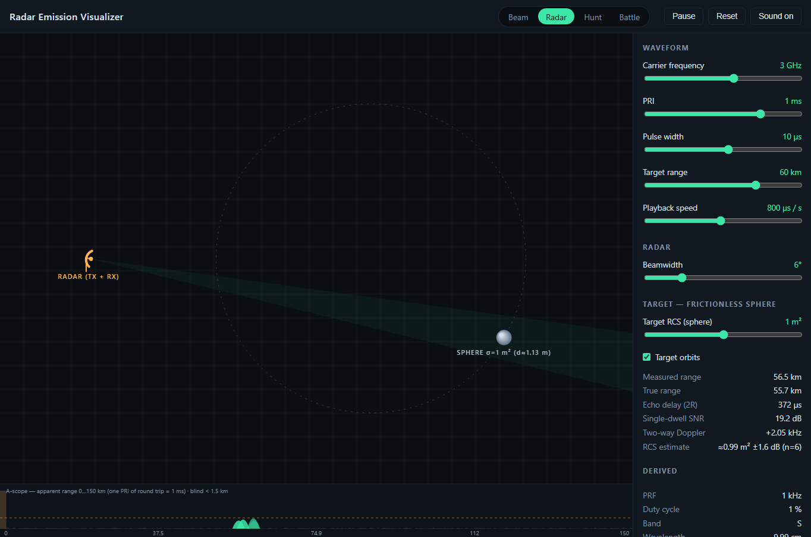
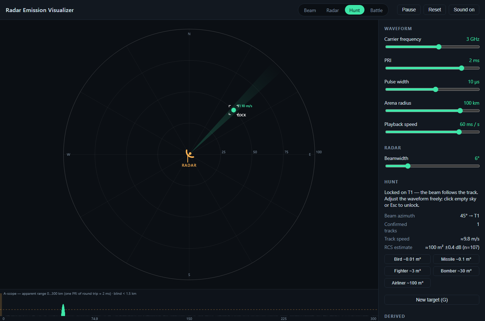

# Radar Emission Visualizer

**▶ Try it out here: <https://charlestw127.github.io/radar-visualizer/>**

A small, dependency-free browser app about radar and EW, in four modes:

- **Beam** — the original visualization: pulses travelling from an emitter to a sensor, as sine bursts or expanding rings, with an optional orbiting sensor (Doppler, path loss).
- **Radar** — a monostatic radar: the dish is both emitter and sensor, pulses bounce off a frictionless sphere and you watch the echo come home to a blip on an A-scope.
- **Hunt** — a game: find, track and identify a hidden aircraft with a steerable beam, plot-to-track association and RCS estimation.
- **Battle** — a game: fly up to four platforms past an automatic search radar using ES (radar warning) and EA (noise jamming, burn-through).

Sliders control the carrier frequency, pulse repetition interval (PRI), pulse width and playback speed everywhere — detection ranges, blind ranges and ambiguities all respond to them. Click anywhere once to enable the sounds.



## Running

No build step. Serve the folder with any static server (ES modules don't load from `file://`):

```bash
npm start                 # uses npx serve on http://localhost:5173
# or
python -m http.server 5173
```

Then open <http://localhost:5173>.

The hosted copy at <https://charlestw127.github.io/radar-visualizer/> redeploys on every push to `main`. GitHub Pages caches files for 10 minutes, so right after an update a browser can pair a fresh `index.html` with stale modules (new controls that do nothing) — hard-refresh (Ctrl+Shift+R / Cmd+Shift+R) if something looks off.

## Controls

All sliders are logarithmic, covering the spans an EW/ESM receiver actually sees:

| Control | Range | What it does |
|---|---|---|
| Carrier frequency | 100 MHz – 40 GHz (VHF → Ka band) | Density of the sine cycles / ring stripes inside each pulse |
| PRI | 1 µs – 10 ms (PRF 1 MHz → 100 Hz) | Time between successive pulses |
| Pulse width | 50 ns – 1 ms | Duration of each pulse → its physical length in flight |
| Emitter–sensor range | 1 – 300 km | Distance the pulse has to cover |
| Playback speed | 1 µs/s – 1 s/s | Simulated time per real second, from ×1 000 000 slow-motion up to real time |

Pulse width is automatically capped at 90 % of the PRI so the duty cycle stays below 100 %.

Derived readouts update live: PRF, duty cycle, IEEE band letter, wavelength, pulse length, unambiguous range, range transit time, slow-motion factor. Keyboard: `Space` pause, `1`–`5` modes (1/2 are the beam styles, 3 radar, 4 hunt, 5 battle), `O` orbit, `G` new round, `E` jam (battle), `R` reset, `M` mute.

A few combinations worth trying:

- **Long-range search radar** – 1.3 GHz (L), PRI 3 ms, PW 100 µs, 250 km, playback 1000 µs/s.
- **Fire-control / tracking** – 9.5 GHz (X), PRI 100 µs, PW 0.5 µs, 20 km, playback 50 µs/s.
- **High-PRF pulse-Doppler** – 10 GHz, PRI 5 µs, PW 1 µs, 10 km, playback 10 µs/s — watch several pulses stack up in flight at once.
- **Real time** – push playback to 1 s/s with any waveform. A pulse crosses 50 km in 167 µs, a hundredth of a frame, so the picture degenerates into a strobe — which is the honest answer to "what does this actually look like". The hit glow, ping and strip still make the PRF legible.

URL parameters: `?mode=radar|hunt|battle` picks the mode; `?style=wave|ring` the beam style; `?orbit=1` starts with the sensor moving; `?t=250` fast-forwards the simulation 250 µs on load; and any slider can be preset by name in its base unit (MHz, µs, km, µs/s) — e.g. `?frequency=35000&pri=5&pulseWidth=1.5&rangeKm=10&timeScale=10` — so a scenario can be shared as a link.

### Animation styles

- **Sine wave** – each pulse is a burst of sine cycles moving along the straight line from emitter to sensor. The burst length is the pulse width; cycle spacing is the wavelength. The pulse is absorbed when it reaches the sensor.
- **Ring pulses** – each pulse is an expanding annulus centred on the emitter. Outer radius = leading edge, inner radius = trailing edge, so ring thickness is the pulse width. Concentric stripes mark the wavelength. When the ring sweeps across the sensor it lights up and a hit burst plays.

Both styles share the same simulation, so switching styles mid-flight keeps every pulse where it was.



A strip along the bottom plots the transmitted pulse train against time (right edge = now), which makes PRI, pulse width and duty cycle easy to read.

### Moving sensor

Tick **Orbit the sensor** (or press `O`, or add `?orbit=1`) and the sensor flies a circle that is off-centre from the emitter, so its range sweeps between about 0.28× and 0.96× the range slider. In ring style it simply flies through the expanding wavefronts; in wave style the beam tracks it like a tracking radar, and the emitter dish turns to follow. A dashed circle shows the path and an arrow shows the velocity — green while closing, amber while opening.

What changes as it moves:

- **Live readouts** – range, radial velocity, one-way Doppler shift (f<sub>d</sub> = v<sub>r</sub>/λ) and path loss (1/R², relative to closest approach).
- **Spectrum** – the envelope shifts by the Doppler and sinks with path loss. Against a short pulse's bandwidth the Doppler is tiny; push the carrier up (Ka band) or the pulse width up (long pulses → narrow spectrum) to see it move. That's the honest picture: single-pulse spectra don't show Doppler, which is why pulse-Doppler radars process many pulses coherently.
- **Sensor glow** dims with range; **pings** get quieter with range and bend in pitch — up while closing, down while opening. The pitch bend is exaggerated (real Doppler is parts-per-million) but direction-correct.

Two sliders: **Platform speed** (10 – 3000 m/s) sets the magnitude of the radial velocity, and **Orbit period** sets how fast the animation goes round, in wall-clock seconds. Those are deliberately decoupled: a 300 m/s platform would not visibly move in ×10 000 slow motion, so the orbit is a stylised animation (frozen while paused), while Doppler and path loss use the slider speed with the orbit's true geometry — closing on one half, opening on the other, zero at closest and furthest approach.

### Spectrum

Below the readouts is the power spectrum of the current waveform, as a spectrum analyser at the sensor would show it:

- A rectangular pulse of width τ has a **sinc² envelope** with nulls every 1/τ either side of the carrier; the panel spans ±4/τ so you see the main lobe and three sidelobes each way. Shorten the pulse and the spectrum spreads; lengthen it and it narrows.
- A coherent pulse train is a **line spectrum** — discrete lines at PRF spacing under that envelope. When the lines are closer than a few pixels at the current span (low duty cycle) they merge into a filled envelope and the caption says *unresolved*, which is exactly what a real analyser does when its resolution bandwidth exceeds the PRF. Push duty cycle up (long pulse, short PRI) to see the lines separate.
- The caption gives null-to-null width 2/τ, the ≈0.886/τ 3 dB bandwidth, and the PRF line spacing.
- The trace brightens while the sensor is being illuminated. The noise floor is cosmetic.

The spectrum is computed analytically from the live slider values (it's a property of what the emitter is transmitting now), not by FFT-ing the animation.

### Sound

Each sensor hit plays a short sonar-style ping, synthesised with the Web Audio API (no audio files). The pitch follows the carrier band — VHF pings low, Ka band pings high. Browsers only allow audio after you've interacted with the page, so the first click or keypress unlocks it. Pings are rate-limited to ~14 per second so high-PRF settings don't turn into a buzz. Toggle with the **Sound** button or `M`.

## Radar, hunt and battle modes

The three radar modes share one measurement engine ([src/rf.js](src/rf.js), [src/radar.js](src/radar.js)): a game-calibrated radar equation in dB with named constants,

```
SNR = K0 + 10·log10(σ) + 10·log10(τ) + 20·log10(f_ref/f) − 40·log10(R) + beam shape + 10·log10(N) − max(0, J/N)
```

so every headline slider genuinely moves detection: bigger RCS σ, longer pulse τ (more energy — but a longer blind range cτ/2), lower band (the VHF early-warning story), more integrated pulses N per dwell. Detections are drawn from a probability curve around a 13 dB threshold, so edge-of-detection targets flicker. Measured range and azimuth carry SNR-dependent errors (beam-splitting, range resolution), ranges beyond c·PRI/2 fold to a false near range (flagged `2nd?`), and echoes inside the transmit pulse are eclipsed. Plots feed an alpha-beta tracker with M-of-N confirmation; each plot also inverts the equation into a running RCS estimate with a confidence interval.

The bottom strip becomes an **A-scope**: amplitude vs apparent range across exactly one PRI of round trip, with the noise floor, the detection threshold, the blind-range block and (in battle) the jamming-raised floor.

### Radar — the bounce demo



The target is a **frictionless sphere**: constant RCS from every aspect, which is exactly why radar engineers calibrate with spheres. Set its RCS (the label shows the equivalent diameter, σ = πr²), its range, and optionally let it orbit — the readouts then show **two-way** Doppler (2v·f/c, double beam mode's one-way shift). Playback is preset slow enough to watch a ring reach the sphere and an echo ring return; the A-scope blip appears at the instant the animated echo lands, and `measured range` vs `true range` shows the measurement noise. Each animated ring stands in for the whole dwell's pulse burst, so detection still integrates the true-timeline pulse count.

### Hunt — find, track, identify



A hidden platform (random class: bird / missile / fighter / bomber / airliner — 40 dB of RCS spread) wanders the arena. Steer the beam with the mouse (slew-limited, like a real antenna), adjust beamwidth with the scroll wheel — wide to search, narrow to refine. Blips build tracks; the RCS estimate firms up with hits (±2 dB/√n); track speed is a second identification cue (a 900 m/s "bird" isn't a bird). Once a track forms, **click it to designate it** — single-target track, like a real radar: the beam auto-follows the track's *estimated* position (LOCK brackets on the PPI), freeing your hands for the waveform sliders. The lock breaks if the track dies — including when your own waveform change stops seeing the target (blind range, too little energy). Click empty sky or `Esc` to go back to manual steer. Call the class from the buttons — wrong calls are free but counted, a correct call reveals the truth and your time.

#### Why your bomber reads as a bird

The RCS estimate is not a measurement of your radar settings — it solves the radar equation *backwards*, per plot: measured SNR minus the SNR a 1 m² target would have produced **at the measured range** with that plot's exact waveform. Every plot snapshots the pulse width, band, integration count, beam-shape loss and jamming level that produced it, and the inversion subtracts them all back out — so the waveform sliders cancel, and a 30 m² bomber reads ≈30 m² on any waveform that can see it at all.

The loophole is in the bolded words: the inversion trusts the range the radar *believes*. Put the target beyond the unambiguous range c·PRI/2 and its echo folds to a false near range (the amber `2nd?` tags). The estimator then reasons "that little SNR, from something this *close*? must be tiny" — and the estimate collapses by 40·log₁₀ of the fold ratio. A 30 m² bomber at 60 km on a short PRI can read as a 0.015 m² bird. The bias only ever runs **low** (a folded range is always nearer than the truth), so a too-big estimate is never ambiguity.

Try it: in hunt, track something around 60–80 km, then drag PRI down to ~300 µs (unambiguous range 45 km). Watch the `2nd?` blips appear at a false near range and the RCS estimate crash by orders of magnitude; restore the PRI and a fresh track reads true again. This is precisely why real radars stagger their PRFs — the true range only reveals itself when the folds disagree.

(Other things that legitimately move the readout: a new round or a fresh track restarts the running average; few hits mean a loose ±2 dB/√n estimate; and in radar mode the Target RCS slider *is* the truth being estimated.)

### Battle — electronic combat

Four platforms (2 fighters, a bomber, a missile) spawn on the western edge; get one inside the **goal ring** around the radar. The radar scans automatically, and a platform continuously **tracked for 8 s is intercepted**. Your EW kit, per platform:

- **ES / RWR** (always on): the amber arc + chirp when the beam sweeps you is truth — you know you're painted even when the radar failed to detect you.
- **EA** (toggle): noise jamming toward the radar. The radar's floor rises (watch the A-scope), your blips vanish, and the radar sees only a bearing **strobe** — direction without range. But the echo grows as 1/R⁴ against the jammer's 1/R²: inside the **burn-through ring** (drawn dashed red, and shown in the panel) the radar sees through your jamming. Jamming also tells everyone where you are — the strobe is a giant arrow.

Click a platform (or `Tab`) to select, click the map to set course, `E` to jam, `G` to restart. Statuses climb HIDDEN → PAINTED → DETECTED → TRACKED → INTERCEPTED.

## What is to scale and what is not

The *timing* is physically exact: time is in microseconds, distance in *light-microseconds* (1 light-µs ≈ 300 m) so propagation speed is exactly 1 unit/µs, and pulse position, pulse length, PRI spacing, transit time and every readout follow from that. Three things are deliberately stylised because real values are sub-pixel at tens of km per canvas:

| Quantity | Real value | On screen |
|---|---|---|
| Carrier wavelength | 3 m at 100 MHz → 7.5 mm at 40 GHz | Cycle spacing is a log mapping of frequency: 48 px at 100 MHz down to 5 px at 40 GHz (`carrierSpacingPx`). Higher frequency still reads as "tighter cycles". |
| Pulse length | 15 m for a 50 ns pulse | Drawn at true length (pulse width × c) but never shorter/thinner than 10 px (`MIN_PULSE_PX`) so it remains visible. At 300 km range the true length of anything under ~4 µs is below that floor. |
| Hit / flash effects | a few µs | Timed in simulated µs, but held for at least ~0.1–0.35 s of wall-clock time so they stay perceptible at fast playback. |
| Sensor orbit | a 300 m/s platform moves 3 cm per simulated 100 µs | Orbit angle advances in wall-clock time (Orbit period slider). Doppler and path loss use the Platform speed slider with the orbit's true radial-direction factor. Ping pitch bend is exaggerated to ±4 semitones. |
| Arena timeline (radar/hunt/battle) | a fighter needs ~6 min to cross 100 km | Platform motion, antenna rotation, dwells and the tracker all run in **game seconds** — true seconds played at **5× wall-clock** (`GAME_TIMELAPSE`). One time base, so every displayed speed/Doppler is true m/s with no conversions. Frozen while paused. |
| Pulses per dwell | ~560 pulses cross a 6° beam at 36°/s and 500 Hz PRF | Detection integrates the TRUE-timeline pulse count N (capped at 64), even when slow playback shows only one animated pulse. In the radar demo, each animated ring stands in for the whole dwell's burst. |
| Echo geometry | a target moves during the echo's flight | The echo ring (and the measured range) uses the target position at the moment of illumination — a snapshot, exact for the slow-motion animation. |
| Detection itself | radar detection is statistical | Deliberately kept: Pd is a logistic curve around SNR = 13 dB, so marginal targets flicker scan to scan — that part is realism, not stylisation. |

The readouts always show the true physical values, so the panel is the reference if the picture is ambiguous.

## Architecture

```
index.html            Page shell: canvas + control panel + mode sections
styles.css            Dark theme, layout, per-mode panel visibility
check.mjs             Node validation of the DOM-free core (run: node check.mjs)
src/
  main.js             Entry point. Wires modes, runs the rAF loop, input, audio
  params.js           Parameter model (PARAM_SPECS, Params class, derived values)
  simulation.js       Pulse-train state machine: emits/prunes pulses, hit detection
  scene.js            Layouts: emitter-left (beam/radar) and radar-centred (PPI)
  controls.js         Builds the slider panel from PARAM_SPECS, syncs with Params
  audio.js            Web Audio "ping" synth, rate-limited, pitch tracks carrier band
  spectrum.js         Analytic sinc² / PRF-line spectrum panel (Doppler-shifted, path-loss scaled)
  sensorMotion.js     Orbiting-sensor model: position, radial velocity, Doppler, path loss
  rf.js               DOM-free radar-equation engine: SNR budget, Pd, jamming, burn-through
  world.js            Arena kinematics in game seconds; Platform classes, GAME_TIMELAPSE
  radar.js            RadarModel: antenna/dwells, analytic detection, paint-delay queue,
                      alpha-beta tracker (M-of-N), RCS estimation, RWR bookkeeping
  games.js            Hunt and Battle state machines (status ladder, intercepts, win/lose)
  modes.js            Mode registry: presets, param memory, mode contexts, cosmetic EchoField
  renderers/
    common.js         Shared drawing: grid, emitter/dish, sensor glow, hit burst, TX strip
    wave.js           Beam style 1 – sine bursts along the beam line
    ring.js           Beam style 2 – expanding annuli with wavelength stripes
    monostatic.js     Radar mode: bounce scene, TX + echo rings, sphere target
    ppi.js            Hunt/battle: phosphor PPI, beam wedge, tracks, strobes, platforms
    scope.js          A-scope strip (apparent range, threshold, blind range, jam floor)
```

### Data flow

```
 sliders ──▶ Params ──subscribe──▶ controls (readouts / clamping)
                │
                └──▶ Simulation.step(dt)  ──▶  pulses[]  ──▶  renderer.render(ctx, layout, sim)
                          ▲                                          │
                          │ timeScale, pri, pulseWidth, frequency     └── sensorIntensity() → hit FX
                          └── rAF loop (main.js)
```

**Params** is the single source of truth for slider values. It clamps to `PARAM_SPECS`, enforces the pulse-width-vs-PRI constraint, and notifies subscribers.

**Simulation** owns simulated time and the list of in-flight pulses. Each pulse *snapshots* the waveform parameters at emission, so moving a slider only affects new pulses — pulses already in the air keep their shape, which makes the effect of each slider obvious. Changing PRI reschedules the next emission relative to the last one rather than restarting the train. `sensorIntensity(distance)` returns 0–1 illumination and registers hit events. A separate `history` list of recent emissions feeds the TX strip, so bars persist after the pulse itself has been culled.

**Renderers** are pure functions `render(ctx, layout, sim)`. They read from the simulation but never mutate pulses (the only thing they set is `sim.maxRange`, the cull distance appropriate for their view). Adding a third style means adding one file under `src/renderers/` and one entry in the `RENDERERS` map in `main.js`.

**Layout** (`scene.js`) maps light-µs to pixels via `pxPerUs = distancePx / rangeUs`, recomputed every frame so both window resizes and the range slider keep the scene proportional.

**Controls** build each slider from `PARAM_SPECS`; `scale: 'log'` specs get a 0–1000 integer slider mapped exponentially onto `[min, max]`, so `Params` always holds real units and the DOM never does.

## Extending

- **New parameter** – add an entry to `PARAM_SPECS` in `params.js`; a slider appears automatically. Snapshot it onto pulses in `Simulation.step` if it should be per-pulse.
- **New style** – create `src/renderers/<name>.js` exporting `render(ctx, layout, sim)` and register it in `main.js` + `index.html`.
- **Received-signal trace, multiple sensors, Doppler** – all fit inside `Simulation` without touching renderers.
